import Callout from "@/components/Callout.astro";

---

## Aplikasi Sadap iPhone dan iPad (iOS)

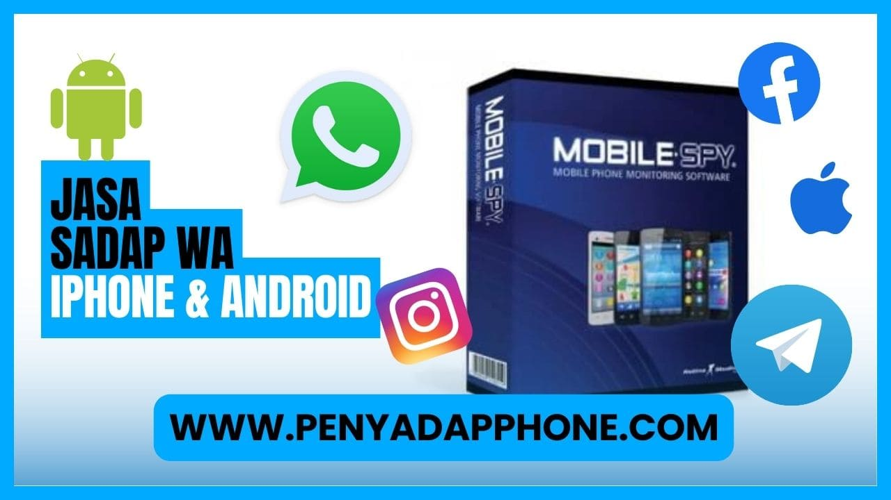

Cara mudah sadap iPhone & iPad _(atau semua ponsel dengan sistem iOS)_ juga untuk hack data WA, Facebook, Telegram, Instagram, Skype, Snapchat, Line, dan sosial media lain dengan panduan paling mudah tanpa harus jailbreak _(install aplikasi dengan Cydia)_ atau lewat iTunes dan iCloud.

**Sadap iPhone hanya membutuhkan beberapa menit saja untuk pemasangan software.**

<Callout type="error">
  **Notice**: Menggunakan alat penyadapan hp adalah perbuatan melawan hukum dan software ini disediakan untuk digunakan secara positif yaitu melindungi orang terdekat _(dan digunakan secara terbatas)_ seperti mengawasi anak Anda, kami tidak bertanggungjawab atas penyalahgunaan dalam bentuk apapun.
</Callout>

<Callout>
  Hubungi: 
  [wa.me/6285-813-232-228](https://wa.me/6285813232228)
</Callout>

## Akses Folder Galeri Jarak Jauh

Akses Folder Galeri *(file manager)* yang di ambil dari memori hp internal seseorang dan juga akses kamera secara.

Pantau gadget dengan melalui fitur remote kamera depan & belakang dari hp target dengan mudah juga dapat download data secara jarak jauh.

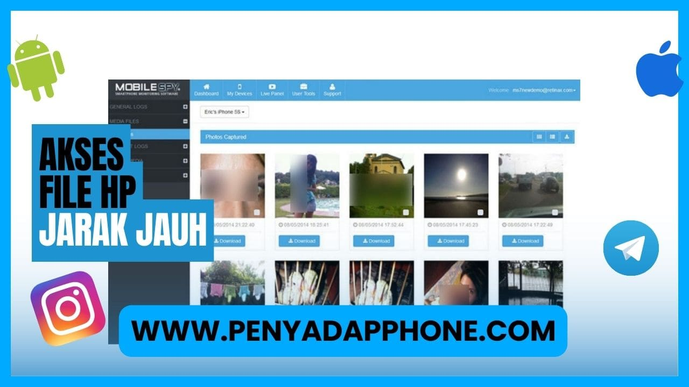

## Jasa Sadap Aplikasi WA

Jasa hack data dari aplikasi chat rahasia WhatsApp dari ponsel iPhone & iPad, pantau setiap aktivitas WA yang dihapus, dengan menggunakan software penyadap hp dan mudah dilakukan.

**Fitur lain:**

* Sadap Pesan Line
* Hack Akun Instagram
* Hack Facebook Messenger
* Bajak Aplikasi Telegram
* Sadap Pesan Skype
* Sadap Pesan Snapchat
* Sadap Pesan Signal
* Hack KiK
* Hack Aplikasi Tinder
* Hack Akun Gmail
* Sadap Pesan Viber

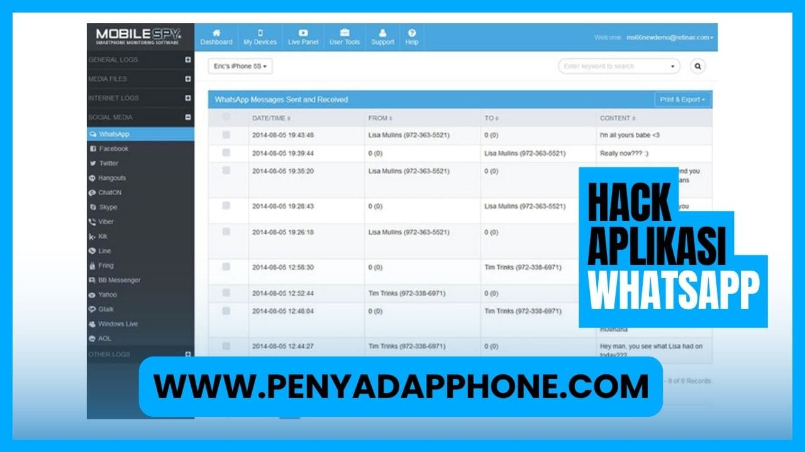

## Lacak Data Lokasi

Cara akurat lacak data lokasi pada setiap tempat yang sudah di kunjungi oleh target secara tepat dan presisi, dengan menggunakan fitur satelit GPS (Global Positioning System) yang tersedia dari smartphone iPhone & iPad, _(dengan catatan GPS aktif di hp target)_.

> Bisa juga digunakan untuk melacak lokasi apabila, ponsel hitang atau diambil oleh seseorang.

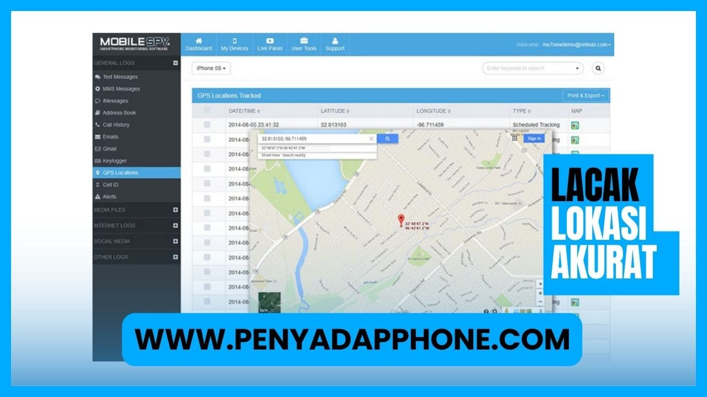

## Rekam Suara Panggilan Telepon

Rekam setiap log panggilan telepon dari iPhone, dengarkan dari setiap aktivitas rahasia dari panggilan masuk dan keluar pastikan setiap komunikasi suara rahasia dari ponsel target secara jarak jauh (setelah pemasangan software berhasil).

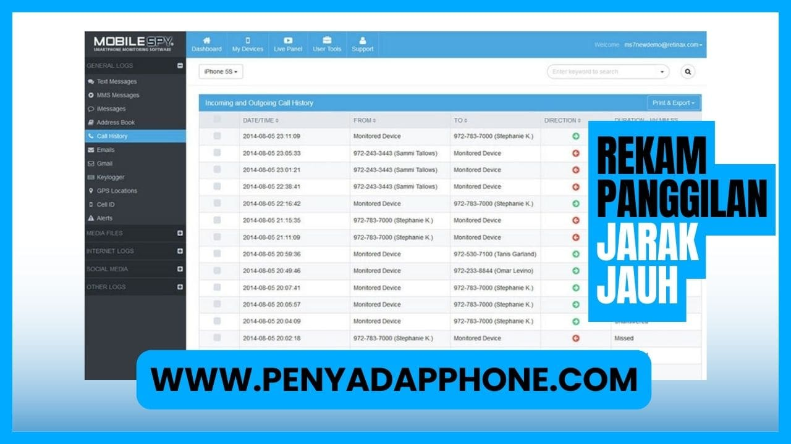

**Untuk pengguna gadget** (Klik untuk meneruskan pemesanan via WhatsApp)

Pesan : Masukan detail tentang handphone target dan pesan penjelasan kenapa melakukan penyadapan pada hhp seseorang?

Pastikan semua data sudah di lengkapi, sebelum di kirim.

* Pemesanan diatas jam 09:00 Malam, kami respon esok pagi
* Jangan mengulangi pemesanan (SPAM)

## Sadap Pesan Email

Sadap pesan masuk dari beberapa provider layanan aplikasi email dari smartphone seseorang dengan mudah, lihat setiap data pesan rahasia email yang masuk dan juga keluar dari beberapa layanan akun Gmail (Google Mail), Yahoo, Hotmail & Aol.

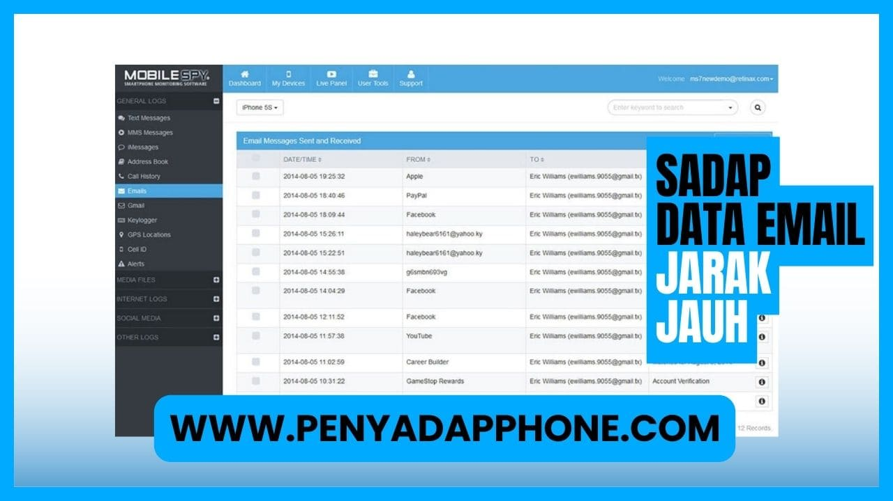

## Sadap Pesan SMS

Sadap setiap data pesan SMS dari hp seseorang dengan mudah, lihat setiap aktivitas pesan rahasia baik pesan masuk atau pesan terkirim dan pesan yang sudah dihapus, untuk menghilangkan jejak.

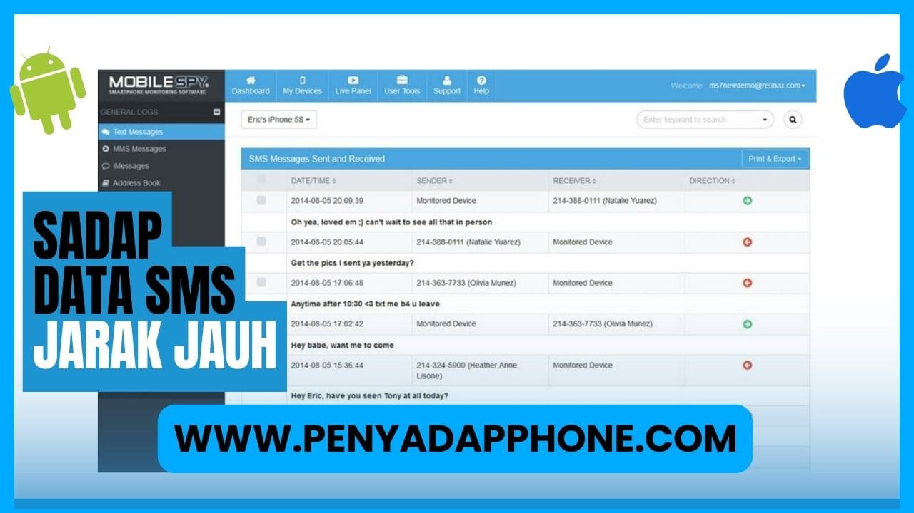

> Sadap HP iOS – software penyadap dengan harga murah dan kualitas terbaik

## Membuktikan Pasangan Selingkuh?

Buktikan Kejujuran Pasangan Selingkuh

Fenomena media sosial dan internet adalah sumber perselingkuhan dalam hubungan pernikahan, perselingkuhan merupakan hal sangat tidak diinginkan dalam setiap hubungan, dengan software sadap ini dapat membantu membuktikan dengan siapa pasangan berselingkuh melalui data komunikasi atau media sosial pribadi miliknya.

<Callout type="warning">
  Buktikan kejujuran pasangan dan cek pasangan melalui ponselnya dan lihat setiap aktivitas rahasia di sosial media.
</Callout>

<Callout type="warning">
  Pastikan sebelum melakukan pemasangan wajib izin atau memberitahu target, atau alternatif lain pasangan aplikasi di hp target _(pasangan)_ dan hp sendiri dan pastika saling mengetahui agar bisa saling percaya.
</Callout>

## Mengawasi Pergaulan Anak Remaja?

Awasi anak remaja lewat hp

Mengawasi pergaulan anak remaja dengan lacak semua kegiatan data komunikasi dengan teman-temannya apa saja yang sudah dilakukan disekolah maupun diluar sekolah.

Jangan tunggu anak remaja terjabak dalam penggunaan obat-obatan terlarang & seks bebas dengan cara ini kita bisa mengontrol anak remaja walau dari rumah ataupun di luar negeri sekalipun.

<Callout type="warning">
  Kontrol anak remaja dari pergaulan bebas, pengawasan remaja paling efektif dengan langsung memantau data ponsel Anak remaja.
</Callout>

## Pastikan Kujujuran & Loyalitas Pegawai?

Cek kejujuran pegawai

Mengawasi loyalitas karyawan & apa saja yang sudah dikerjakan, apa dia bekerja dengan tepat? atau sebaliknya.

Monitoring data handphone karyawan bisa melihat aktifitas setiap produktivitas! walaupun Anda sedang tidak ditempat kerja / diluar kota sekalipun Anda tetap bisa mengawasi. Setiap aktivitas data rahasia yang dilakukan oleh pegawai Anda.

<Callout type="info">
  Pastikan ponsel yang akan dipasangan aplikasi mobile spy adalah perangkat fasilitas dari perusahaan, dan perlu memberitahu pada pegawai bahwa dipasang aplikasi pengawas aktivitas rahasia.
</Callout>

## DEMO APLIKASI SADAP

**Demo Sadap Pesan SMS**

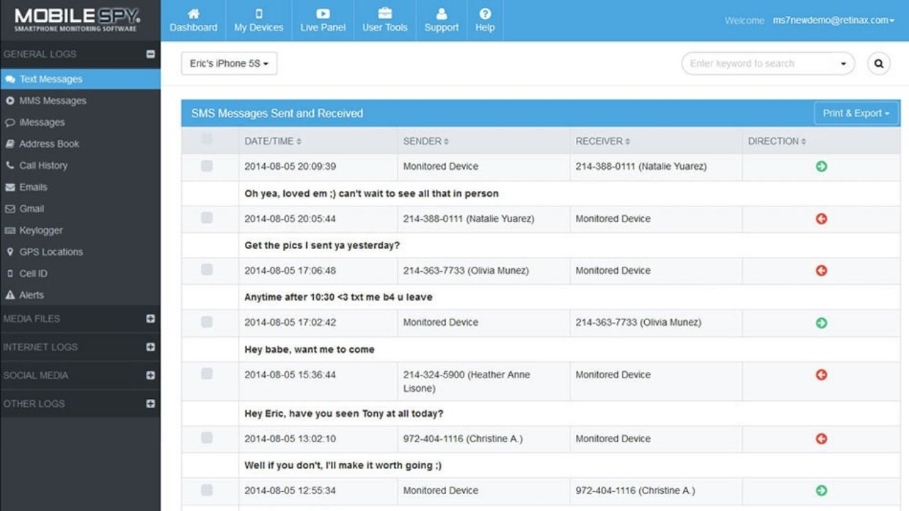

Sadap setiap data pesan sms dari ponsel target, lihat setiap aktivitas pesan sms baik pesan masuk atau pesan terkirim dan pesan sms yang dihapus oleh target.

**Demo Bajak WhatsApp**

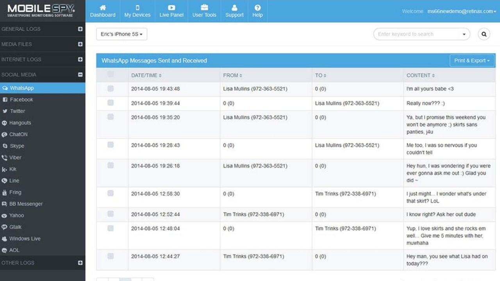

Jasa penyadap data chat WhatsApp rahasia dari iPhone & iPad, pantau setiap aktivitas WA yang dihapus, dengan menggunakan software penyadap hp.

**Demo Lacak Lokasi**

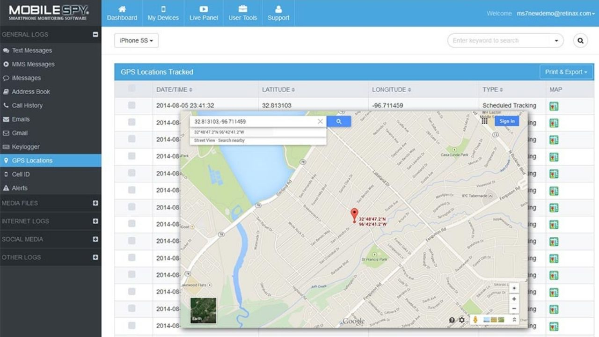

Melacak lokasi pada setiap tempat yang di-singgahi oleh target secara tepat dan real time, dengan menggunakan fitur Tracker GPS dari smartphone iPhone & iPad.

**Demo Sadap Kamera**

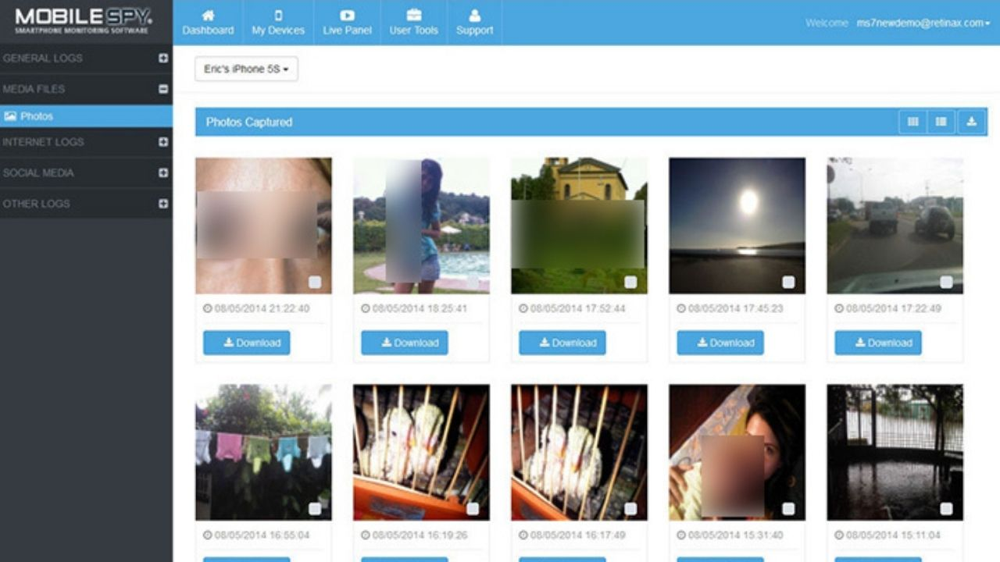

Sadap file foto yang di ambil dari kamera secara jarak jauh. Pantau dengan melalui fitur remote kamera depan & belakang dari ponsel 
target dengan mudah juga dapat download data.

**Demo Sadap Panggilan Telepon**

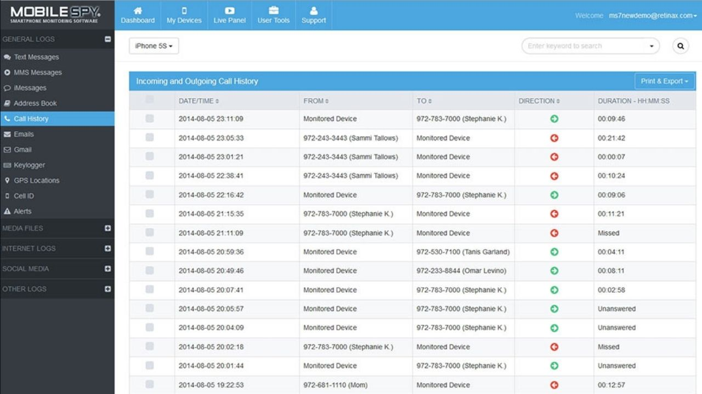

Rekam obrolan panggilan telepon selular, dengarkan semua setiap aktivitas percakapan masuk dan keluar data komunikasi suara rahasia dari ponsel target dengan jarak jauh.

**Demo Hack Pesan Email**

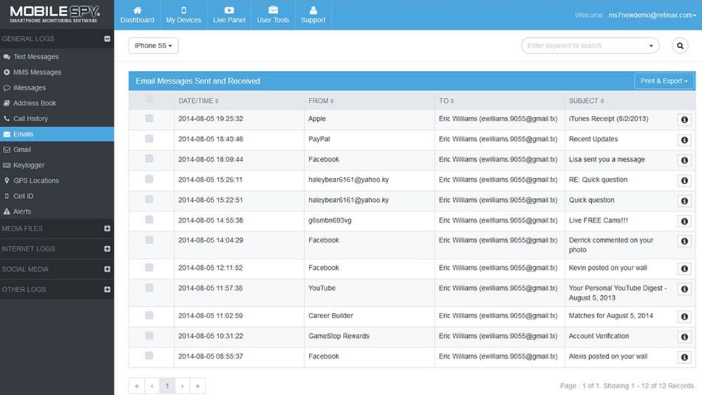

Sadap pesan masuk email dari ponsel target, lihat setiap data pesan email yang masuk dan juga keluar dari beberapa layanan email Gmail (Google Mail), Yahoo, Hotmail & Aol.

## Beberapa Testimonial 

> **Angela Putri** Sangat disarankan buat kakak atau orangtua yang punya anak remaja buat ngawasi pergaulan terlebih lagi ada fitur Lacak Lokasi dan bisa mengambil semua data lokasi terbaru secara baik, terima kasih.

> **Sarif Caniago** Sangat membantu buat mengawasi pasangan bagus ada fitur sadap Line juga WhatsApp bisa pantau terus 24 jam nonstop hehe...

> **Doni Wahono** Selama menggunakan dengan bijak untuk melindungi keluarga gak ada masalah asal jangan digunakan untuk melanggar hukum keren fiturnya sangat lengkap dan mudah bisa mengawasi calon istri terutama.

> **Kadinundin Basaro** Jaman sudah semakin bebas seperti dunia media internet semakin berkembang perselingkuhan semakin sering terjadi dituntut bijak mengatasi berkembangan jaman, terima kasih udah membantu sangat disarankan dan lengkap fiturnya terutama Whatsapp, Panggilan Suara dan lokasi.

> **Bintang Sitanggang** Mantap bisa melihat data rahasia secara real-time rekomen banget apalagi fitur sadap sangat lengkap, Sadap Kamera, Sadap WA, Instagram, LINE, Telegram, LOKASI dan juga rekam panggilan suara jarak jauh setelah pemasangan aplikasi.

> **Jauhari Chandra** Thanks gan sekarang ane bisa hidup tenang bisa mantau pasangan dan juga anak perempuan saya dengan mudah mengawasi di sosial media dan aplikasi chat yang ada di handphone seseorang, seperti Whatsapp, Facebook, Snapchat SMS, pokoknya sangat membantu.

## Beberapa pertanyaan yang sering ditanyakan

Kami telah mengumpulkan pertanyaan yang paling sering diajukan di halaman ini untuk membantu mendalami fungsi dari perangkat ini. Halaman ini terdiri dari beberapa bagian Pertanyaan Pengurutan Umum dan Pertanyaan Teknis.

## Tanpa memegang HP target?

Ketentuan penggunaan penyadapan tanpa harus memegang hp target itu tindakan ilegal & melanggar hukum. Yang kami sediakan di sini adalah perangkat, digunakan untuk hal positif yaitu memantau data seseorang secara terbatas / orang terdekat keluarga.

Jadi syaratnya pembelian tetap harus memegang untuk memasang perangkat sadap ini secara manual di hp seseorang yang Anda kenali dan meminta izin.

## Sadap HP dikunci PIN, Pola, Finger, Pengenalan Wajah dan Retina?

Membuka kunci keamanan seperti pola, PIN, retina, wajah, atau sidik jari untuk install aplikasi sadap hp. Adalah tindakan tidak sah yang melanggar hukum dan etika.

Penting untuk memahami bahwa setiap perangkat memiliki sistem keamanan yang dirancang untuk melindungi data dan privasi pengguna.

Mendapatkan akses tanpa izin merupakan pelanggaran terhadap hak privasi seseorang dan bisa berimplikasi hukum yang serius dan untuk menggunakan aplikasi perlu izin pada target.

## Bagaimana mekanisme pengiriman software?

Panduan pemasangan akan dikirimkan melalui email setelah Anda melakukan konfirmasi pembayaran, jadi pemasangan dilakukan oleh Anda, apabila nanti Anda mengalami kesulitan dalam hal pemasangan, tim teknis kami siap membantu & memandu Anda untuk memproses pemasangan secara detail, baik itu melalui telepon ataupun melalui email.

> Intinya kami akan memberi support sampai Anda berhasil 100% untuk memasang program yang sudah Anda beli.

## Apakah anda ragu dengan transaksi Online?

Untuk memahami kekhawatiran Anda, karena itu kami menyediakan opsi pembelian secara langsung melalui agen penjualan, yang berada di beberapa kota besar di Indonesia. 

Pembelian melalui agen dikenakan biaya tambahan sebesar Rp. 300.000 + Biaya Transport (disesuaikan dengan jangkauan) _(sudah tidak tersedia)_. 

Biaya tersebut sepenuhnya diberikan kepada agen kami untuk jasa pemasangan. Pembayaran tunai bisa dilakukan di tempat setelah software 
sudah diuji dan berfungsi dengan baik. Hubungi untuk informasi lebih lanjut.

## Apakah software dapat digunakan lebih dari 1 HP?

Software penyadap hanya dapat dipasang pada satu ponsel saja, apabila target memiliki lebih dari satu hp & anda berencana untuk menyadap semua hp target maka Anda harus membeli software sebanyak ponsel yang dimiliki target.

## Perangkat Sadap disalahgunakan untuk tujuan ilegal?

Sudah jelas bahwa sebelum masuk ke situs kami, anda telah setuju dengan **Ketentuan Penggunaan** _“DISCLAIMER”_
yang berarti anda telah setuju dengan aturan hukum yang berlaku di **INDONESIA** termasuk aturan-aturan yang telah kami buat.

Jadi apapun yang terjadi yang berhubungan dengan perangkat sadap kami, kami tidak bertanggung-jawab & sepenuhnya menjadi tanggung-jawab masing-masing pengguna.

## Syarat untuk dapat menggunakan software sadap iPhone?

Syarat utama adalah anda harus memasang software target, Tidak semua tipe ponsel dapat dipasang dengan software ini. 

Untuk menentukan tipe HP yang kompatibel dengan software ini silahkan masuk ke halaman pemesanan, program ini dijamin bekerja 100% dengan syarat ponsel target harus kompatibel dengan program sadap iOS.

## Device untuk memonitoring data?

Untuk melihat hasil penyadapan sudah kami sediakan di perangkat apapun, karena alat pemantuannya bisa Anda pasang pada ponsel Anda. jadi hp 
pemantau bisa tipe hp dan merk apapun.

Karena hanya digunakan untuk menerima / memantau data komunikasi dari hp target secara jarak jauh.

## Berapa lama prosesnya?

Pemesanan dalam jam kerja akan diproses secepatnya, dan untuk mempercepat anda dapat melakukan konfirmasi melalui sms / panggilan ke nomor hp yang tercantum di situs kami. Pengiriman software kurang dari 2 jam setelah melakukan konfirmasi.

Untuk pembayaran di atas jam 9-Malam, perangkat sadap akan di kirim esok hari.

## Bagaimana kalau target mengganti simcard?

Jika target ganti kartu sim, tapi tetap pada ponsel yang sama, maka perangkat sadap ini akan tetap berjalan tanpa ada gangguan 
dengan perubahan nomer.

Sistem kerja penyadapan ini akan diam-diam mengirimkan pemberitahuan pada panel monitoring, apabila target mengganti 
nomer sehingga kita bisa mengetahui nomor target yang baru.

Jadi, apabila ponsel target hilang, memungkinkan Anda untuk dapat mencari lokasi keberadaannya.

## Apakah HP CDMA bisa menjalankan program ini?

Untuk sekarang tersedia, untuk semua jenis ponsel seperti GSM / CDMA dan lainnya dan dapat berjalan juga kompatibel dengan perangkat sadap iPhone dan iPad.

## Apakah memberikan dukungan teknis?

Tidak hanya dukungan teknis kami menyediakan Anda petunjuk langkah demi langkah, pembaruan dan dukungan online selama 2 minggu. Dalam kasus yang mungkin sangat jarang terjadi.

Tim dukungan kami akan memberi Anda bantuan langkah demi langkah bagaimana untuk dapat memperbaiki masalah yang Anda alami. Dijamin 100%.

## Kebijakan privasi pada data Anda?

Ini adalah kebijakan kami bahwa basis data pelanggan kami tetap bersifat rahasia / pribadi. Kami belum, tidak akan, dan tidak akan pernah 
menjual identitas kepada atau pihak lain yang ingin menggunakan database kami untuk mengiklankan atau meminta produk atau layanan.

Produk kami tidak mengumpulkan informasi dari telepon Anda selain informasi yang diperlukan untuk keberhasilan pemasangan perangkat.

## Apakah Anda memberikan pembaruan perangkat lunak?

Selama Anda adalah pelanggan kami, Anda akan menerima upgrade terbaru untuk perangkat lunak secara gratis. Kami mengumumkan peningkatan perangkat lunak melalui halaman web / email pribadi Anda.

## Apakah Penyadap dapat bekerja di setiap ponsel?

Software penyadap dapat bekerja pada smartphone mana pun yang menjalankan sistem operasi iOS. Sebagian daftar ponsel yang kompatibel dapat ditemukan di sini.

Saat membaca penjelasan ini dengan pertimbangan memiliki smartphone yang kompatibel dengan perangkat sadap, perlu diketahui bahwa kompatibilitas berarti tidak hanya Tipe / Model ponsel, namun juga Firmware / Operating System Version yang digunakan ponsel target. 

Semua versi sistem operasi yang kompatibel bagian yang sesuai. Akun telepon 
Anda harus memiliki akses Internet untuk melihat data hasil penyadapan.

## Apa langkah dasar untuk pemasangan?

Apapun smartphone yang akan Anda sadap, langkah pertama untuk memantau pasangan, anak atau karyawan Anda dengan memasang app sadap adalah Anda bisa melakukan lengkap sesuai petunjuk di halaman yang sudah kami sediakan.

Setelah mendownload Anda, buka halaman petunjuk di pertanyaan berikutnya untuk jenis smartphone mana yang akan Anda sadap. Untuk rincian lebih lanjut tentang pemesanan, dan lihat Panduan Pengguna.

## Setelah download perangkat sadap HP apa berikutnya?

Setelah mengunduh app, Anda harus mengunjungi halaman petunjuk instalasi untuk sistem operasi yang Anda target. 
Ini akan menjelaskan secara rinci bagaimana memasang penyadap langsung ke ponsel target Anda yang ingin Anda monitoring.

## Mengapa Sadap GPS tidak bekerja?

Log GPS yang masuk di versi 3.0 atau yang lebih baru di perangkat iPhone dan iPad. Perangkat Anda HARUS memiliki 
fitur layanan GPS untuk dapat melacak GPS dan agar bekerja.

Lokasi dikirim saat sinyal GPS tersedia. Penyadap bisa mendapatkan lokasi HANYA saat penerima GPS di 
ponsel target, dan akan dapat menerima lokasi secara live.

Jika tidak di-aktfikan fitur gps maka lokasi tidak bisa ditemukan, juga tidak ada informasi yang bisa diambil oleh perangkat sadap. 

Penyedia layanan Anda mengenakan biaya untuk layanan GPS, atau pastikan ponsel target Anda memiliki fitur / mengaktifkan agar lokasi GPS dapat dilacak.

## Berapa data target saya disimpan di software?

Semua log yang disimpan di software sadap Anda akan secara otomatis menghapus setelah tiga puluh (30) hari.

Kami menyarankan pelanggan yang ingin menyimpan data log mereka ke file format CSV di dalam panel penyadap dengan mengklik link "Download CSV" di setiap halaman log.